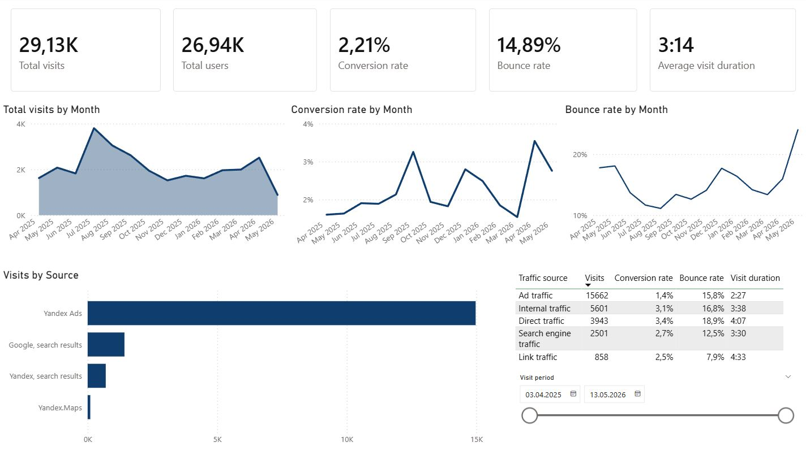

# Yandex Metrika analytics dashboard

This is a small web analytics pet project built around real Yandex Metrika data.

The goal was to build a complete analytics workflow instead of creating a few charts from a static CSV file.

The project covers the full pipeline: data extraction, cleaning, SQL transformations, and dashboard creation in Power BI.

---

## Workflow

1. Extract data from the Yandex Metrika API
2. Clean and prepare the data with Python and SQL
3. Load data into PostgreSQL
4. Build analytical tables with SQL
5. Create an interactive Power BI dashboard

---

## Tech stack

* Python
* Pandas
* PostgreSQL
* SQL
* Power BI

---

## Architecture

```text
Yandex Metrika API
        ↓
Python ETL
        ↓
PostgreSQL
        ↓
SQL marts
        ↓
Power BI dashboard
```

---

## Metrics used in the dashboard

* Visits
* Users
* Conversion Rate
* Bounce Rate
* Average Visit Duration

---

## Dashboard preview



---

## Dashboard features

The dashboard includes:

* traffic trends over time;
* conversion analysis;
* bounce rate analysis;
* traffic source comparison;
* average session duration;
* traffic distribution by channel.

Most of the work actually went into data preparation rather than visualization.

I spent a good amount of time dealing with PostgreSQL data types, metric aggregation, Power BI formatting issues, and building cleaner analytical tables for reporting.

---

## How to run

1. Clone the repository
2. Install dependencies
3. Add your Yandex Metrika API token
4. Run the Python ETL script
5. Refresh the Power BI dashboard

---

## Possible improvements

Things I would like to add later:

* automated pipeline refresh;
* dbt models;
* Docker support;
* deeper traffic segmentation;
* separate engagement and retention analysis pages.
